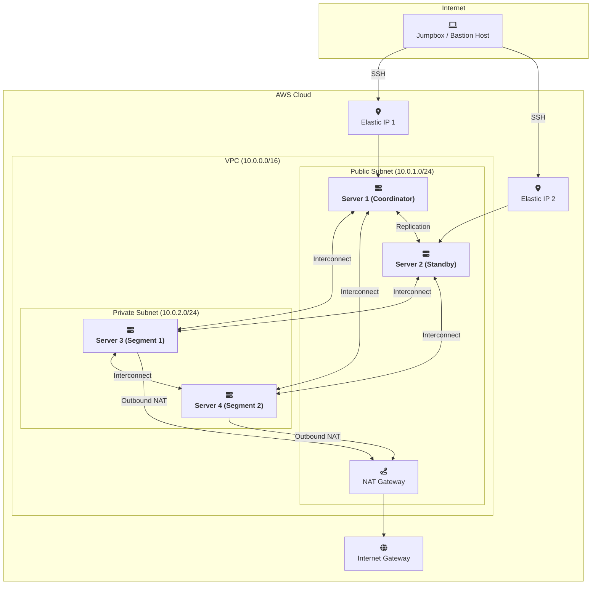

-----

# Deploy a 4-node WarehousePG Cluster (with MinIO pre-installed) on AWS with Terraform

This repository provides a set of Terraform configurations and helper scripts to automate the deployment of a 4-node <a href="https://warehouse-pg.io/" target="_blank" rel="noopener noreferrer">WarehousePG 7</a> cluster on AWS.

The cluster will also have MinIO Server pre-installed on the Standby Coordinator node.

The deployment is managed by a user-friendly wrapper script (`deploy.sh`) that prompts for necessary configuration details, making the setup process straightforward.

-----

## 🏛️ Architecture

The Terraform scripts will provision the following AWS resources, creating a logically separated and secure environment for the WarehousePG cluster:

  * **VPC:** A dedicated Virtual Private Cloud with a `10.0.0.0/16` CIDR block to isolate the cluster network.
  * **Subnets:**
      * A **public subnet** (`10.0.1.0/24`) for the Coordinator and Standby Coordinator nodes.
      * A **private subnet** (`10.0.2.0/24`) for the two Segment nodes.
  * **Internet & NAT Gateways:**
      * An Internet Gateway to allow outbound internet access from the public subnet.
      * A NAT Gateway placed in the public subnet, enabling instances in the private subnet (the segment nodes) to access the internet for software downloads without being publicly exposed.
  * **EC2 Instances:** Four EC2 instances based on a Rocky Linux 8.9 AMI (`ami-020c6cfb9f8b61b53`).
      * **Server 1 (Coordinator):** In the public subnet with a public Elastic IP.
      * **Server 2 (Standby Coordinator):** In the public subnet with a public Elastic IP.
      * **Server 3 (Segment host 1):** In the private subnet.
      * **Server 4 (Segment host 2):** In the private subnet.
  * **Security Group:** A single security group that:
      * Allows inbound SSH access from a designated jumpbox ip address.
      * Allows all internal traffic within the VPC for seamless communication between cluster nodes.
  * **Elastic IPs:** Two Elastic IPs are assigned to the Coordinator and Standby Coordinator nodes to provide them with static public IP addresses.

### Architecture Diagram




-----

## ✅ Prerequisites

Before you begin, ensure you have the following installed and configured:

1.  **AWS Account:** An active AWS account with permissions to create the resources listed above.
2.  **AWS CLI:** The AWS Command Line Interface installed and configured with your credentials. The `deploy.sh` script specifically uses a named profile.
3.  **Terraform:** Terraform CLI (version 1.0 or later) installed.
4.  **SSH Key Pair:** A public/private SSH key pair that you will use when connecting to the cluster. If you don't have one, you can generate it with `ssh-keygen -t rsa`.
5.  **EDB Repo Token:** You need a valid EDB repository token to download WarehousePG. This is passed as a sensitive variable.
5.  **Public IP Address of your Jumpbox host:** You will need to designate a single public ip address that you will `ssh` to the cluster from.

-----

## 🚀 Deployment Steps

The deployment process is broken down into two main phases:

1.  **Infrastructure Provisioning** using the `deploy.sh` script and Terraform.
2.  **Cluster Initialization** using the `setup_whpg.sh` script on the coordinator node.

### Phase 1: Infrastructure Provisioning

1.  **Clone the Repository**

    ```bash
    git clone https://github.com/bluethumpasaurus/terraform-whpg7-cluster-aws
    cd terraform-whpg7-cluster-aws
    ```

2.  **Run the Deployment Script**

    Make the `deploy.sh` script executable and run it. This script will guide you through the configuration process.

    ```bash
    chmod +x deploy.sh
    ./deploy.sh
    ```

3.  **Provide Configuration Details**
\
    The script will prompt you for the following information. You can press Enter to accept the default values in brackets.

      * `Enter your AWS IAM Profile Name`: The named AWS profile to use for authentication.
      * `Enter the AWS Region`: The AWS region for deployment.
      * `Enter the EC2 Instance Type`: The instance size for all four nodes.
      * `Enter a unique name for your cluster`: A prefix for all created resources.
      * `Enter the ip address to be used for SSH`: This will limit `ssh` access to ONLY this ip address.
      * `Enter the path to the SSH PUBLIC KEY`: The path to your `.pub` file.
      * `Enter the path to the SSH PRIVATE KEY`: The path to your private key file.
      * `Enter your EDB Repo Token`: Your secret token from EDB.

4.  **Review and Apply Terraform Plan**

    The script will initialize Terraform (`terraform init`) and show you an execution plan (`terraform plan`). Review the plan and, when prompted, type `yes` to create the resources in AWS with `terraform apply`.

    Typing `no` to the prompt will exit the process, and will give instructions on how to manually perform the  `terraform apply` later.


6.  **📋 Gather Terraform Outputs**

    Once the deployment is complete, Terraform will display a list of outputs similar to those shown below. 

    Copy the `ssh_command_for_whpg_coordinator` and `ssh_command_for_whpg_coordinator_standby` outputs, as you will need them to `ssh` to these hosts.

    ```
    Outputs:

    coordinator_private_ip = "10.0.1.100"
    coordinator_standby_private_ip = "10.0.1.101"
    segment_server_1_private_ip = "10.0.2.200"
    segment_server_2_private_ip = "10.0.2.201"
    ssh_command_for_whpg_coordinator = "ssh -i ~/.ssh/id_rsa rocky@52.123.45.67"
    ssh_command_for_whpg_coordinator_standby = "ssh -i ~/.ssh/id_rsa rocky@52.123.45.68"
    ```

### Phase 2: Cluster Initialization

1.  **SSH into the Coordinator Node**

    On the jumpbox, use the `ssh_command_for_whpg_coordinator` command from the Terraform output to connect to the primary coordinator server. 

    You will log in as the `rocky` user.

    ```bash
    # Use the command from your output
    ssh -i ~/.ssh/id_rsa rocky@<coordinator_public_ip>
    ```

2.  **Switch to the `gpadmin` User**

    The repo's `configure-instance.sh.tpl` script created a `gpadmin` user. Switch to this user to perform the WarehousePG cluster initialisation tasks. 


    ```bash
    sudo su - gpadmin
    ```


3.  **Run the Cluster Initialization Script**

    There will be a WarehousePG cluster initialisation script located at `/home/gpadmin/setup_whpg.sh`. 

    `source` the script to run it - this will set up passwordless SSH, create data directories, initialize the WarehousePG database system, and add a Standby Coordinator.


    ```bash
    source setup_whpg.sh
    ```

    The script will take a few minutes to complete.

4.  **Verification**

    The script will automatically run `gpstate -f` and a `psql` query at the end to verify that the coordinator standby is active and that all segments are configured correctly.

-----

## 💻 Connecting to the Database

Once the setup is complete, you can connect to your new WarehousePG database.

1.  Ensure you are logged into the **coordinator node** as the **`gpadmin`** user.

2.  The `/home/gpadmin/setup_whpg.sh` script will have configured the `.bashrc` file with the necessary environment variables. Simply run `psql`:

    ```bash
    psql
    ```

You are now connected to the `aws_whpg7` database and can begin creating tables and loading data.

-----

## 💿 Setting up MinIO 

MinIO Server is pre-installed on the Standby Coordinator node, with a MinIO drive setup at `/data/minio-storage/` . The `mc` client is pre-installed on the Coordinator node.


1.  Ensure you are logged into the **coordinator node** as the **`gpadmin`** user.

2.  Set up an `mc` alias to connect to the MinIO server on the **standby coordinator node**.

    ```bash
    mc alias set standby_minio http://10.0.1.101:9000/ minioadmin minioadmin
    ```

3.  With `mc` confirm the connection to the MinIO server on the **standby coordinator node**.

    ```bash
    mc admin info standby_minio
    ```

-----

## 🧹 Clean Up

To avoid ongoing AWS charges, you can destroy all the resources created by this project. From your local machine (where you ran `./deploy.sh`), execute:

```bash
terraform destroy
```

Type `yes` when prompted to confirm the deletion.


-----

## 🛠️ Troubleshooting

1.  Possible AMI Issues if deploying to an AWS region other than **eu-west-2**:

- **Note** that the repo's `main.tf` script hard-codes the AMI for Rocky Linux 8.9 in the **eu-west-2** AWS region.
- These AMI codes are not guaranteed to be uniform across AWS regions, unfortunately. 
- This means so you will likely need to replace the AMI identifier in the repo's `main.tf` script with a region-specific one, if you are deploying to a region other than **eu-west-2**.


